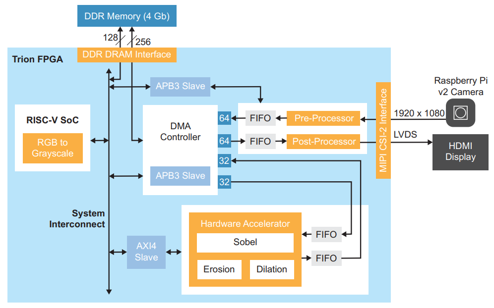
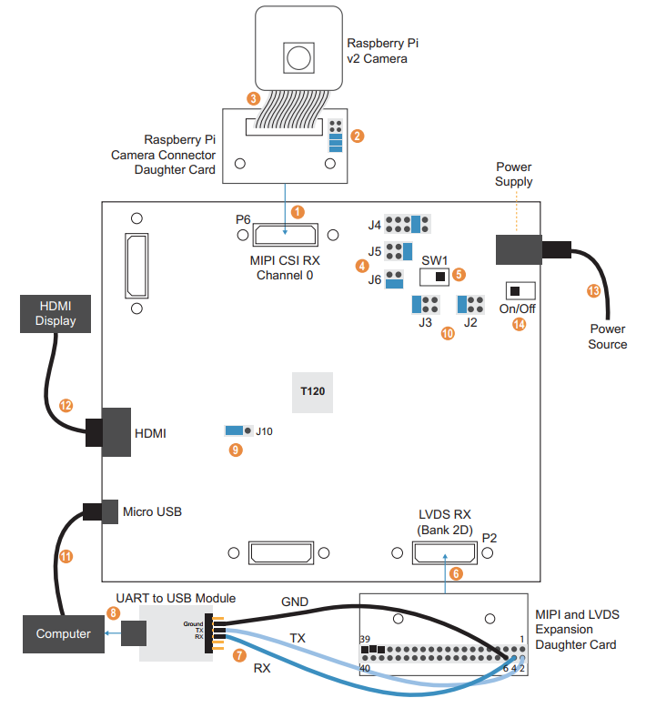

# Edge Vision SoC Framework

Welcome to the Edge Vision SoC GitHub repo. Efinix offers an RISC-V SoC framework targeted for Edge Vision applications, namely Edge Vision SoC (EVSoC) framework. This site provides source codes, example designs, and supporting materials of the EVSoC framework.
- [Key Features](#key-features)
- [Image Signal Processing Example Design](#image-signal-processing-example-design)
- [Documentation](#documentation)
- [Frequently Asked Questions](#frequently-asked-questions)

## Key Features
- **Modular building blocks** to facilitate different combinations of system design architecture.
- **Established data transfer flow** between main memory and different building blocks through Direct Memory Access (DMA).
- **Ready-to-deploy** domain-specific **I/O peripherals and interfaces** (critical SW drivers, HW controllers, pre- and post-processing blocks are provided).
- Highly **flexible HW/SW co-design** is feasible (RISC-V performs control & compute, HW accelerator for time-critical computations).
- Enable **quick porting** of users' design for **Edge AI and Vision solutions**.

## Image Signal Processing Example Design

### Overview

Image Signal Processing (ISP) example design is the first design available on the EVSoC framework. There are five main building blocks in the EVSoC framework, which facilitate ease of modification to suit for various system architecture requirements:
- **Ruby Vision RISC-V SoC**
- **DMA Controller**
- **Camera**
- **Display**
- **Hardware Accelerator**



The ISP example design demonstrates a use case on the EVSoC framework, specifically, **hardware/software co-design for video processing**. Additionally, the design shows how user can **control the FPGA hardware using software**, that is, user can enable different hardware acceleration functions by changing firmware in the RISC-V processor.

This example presents these concepts in the context of video filtering functions; however, user can use the same design with **own hardware accelerator block** instead of the
provided filtering functions. The design helps user explore **accelerating computationally intensive functions** in **hardware** and using **RISC-V software** to **control that acceleration** as well as to **perform computations** that are **inherently sequential or require flexibility**.

### Hardware & Software Setup

The ISP example design is implemented on [Trion® T120 BGA324 Development Kit](https://www.efinixinc.com/products-devkits-triont120bga324.html).



Efinity® IDE is required for project compilation and bitstream generation, whereas RISC-V SDK (includes Eclipse, OpenOCD Debugger, etc) is used to manage RISC-V software projects and for debugging purposes.

Please refer to [EVSoC User Guide](docs/evsoc_isp_example_design_ug-v1.1.pdf) for more detail on the hardware and software setup.

### Software Tools Version
- [Efinity® IDE](https://www.efinixinc.com/support/efinity.php) v2020.2.299
- [RISC-V SDK](https://www.efinixinc.com/support/ip/riscv-sdk.php) v1.1

***Note:*** Kindly refer to [EVSoC User Guide](docs/evsoc_isp_example_design_ug-v1.1.pdf) to get started.

## Documentation
- [EVSoC User Guide](docs/evsoc_isp_example_design_ug-v1.1.pdf)
- [Ruby Vision RISC-V SoC Datasheet](docs/riscv-ruby-vision-ds-v1.0.pdf)
- [Raspberry Pi Camera Module v2 Datasheet](docs/imx219_camera_datasheet.pdf)
- [Trion T120 BGA324 Development Kit Overview](https://www.efinixinc.com/docs/trion-t120f324-overview-v1.1.pdf)
- [Trion T120 BGA324 Development Kit User Guide](https://www.efinixinc.com/docs/trion120f324-devkit-ug-v2.1.pdf)

## Frequently Asked Questions
1.	**Where are the HW/RTL and SW/firmware source files located?**

    The top-level RTL file is named *edge_vision_soc.v*, which is located in respective project folder in *soc_hw/efinity_project* directory. The rest of the RTL files are placed in *soc_hw/source* directory, which are organized according to respective building block. On the other hand, the main firmware file is named *main.c*, which is in *soc_sw/software/evsoc_ispExample\*/src* directory, where other related drivers are provided in the same folder as well.
    
    Below depicts the directory structure of EVSoC framework:
    
    ```
    evsoc
    |-- docs
    |-- soc_hw
    |   |-- efinity_project
    |   |   |-- T120F324_devkit_hdmi_1280_720
    |   |   `-- T120F324_devkit_hdmi_640_480
    |   |-- sim
    |   `-- source
    |       |-- cam
    |       |-- display
    |       |-- dma
    |       |-- fifo
    |       |-- hw_accel
    |       `-- soc
    `-- soc_sw
        |-- bsp
        |   `-- efinix
        |       `-- EfxRubySoc
        |           |-- app
        |           |-- include
        |           |-- linker
        |           `-- openocd
        |-- config
        |-- config_linux
        `-- software
            |-- common
            |-- driver
            |-- evsoc_ispExample
            |   `-- src
            |-- evsoc_ispExample_demo
            |   `-- src
            |-- evsoc_ispExample_demo2
            |   `-- src
            |-- evsoc_ispExample_sim
            |   `-- src
            `-- evsoc_ispExample_timestamp
                `-- src
    ```

2.	**Why is zooming effect observed on ISP example design, especially for 640x480 resolution?**

    This is due to the default setup performs cropping on the incoming 1920x1080 resolution MIPI camera frames to a smaller size eg., 640x480 resolution, prior to further processing. There are two ways to improve the overall captured view for small resolution: (a) Adjust camera binning mode setting in SW; (b) Insert scaler module in HW.

    For (a), user can modify the binning mode setting in camera SW driver (*PiCamDriver.c*). By making the following modifications:

    ```
    //PiCam_SetBinningMode(0, 0);
    PiCam_SetBinningMode(1, 1);
    ```
    
    2x vertical and 2x horizontal binning are performed. After the update, 2x taller and 2x wider frame view can be observed. Refer to [Raspberry Pi Camera Module v2 Datasheet](docs/imx219_camera_datasheet.pdf) for more detail about camera setting.

    For (b), please refer to the [reference design](https://www.efinixinc.com/support/ed/t120f324-hdmi-rpi.php) in Efinix support portal for integration of a scaler module.

3.	**Why are captured frames not of central view of the camera?**

    This is due to the default setup for cropping is with X- and Y-offsets *(0,0)*. To adjust the cropping offsets, modify the *CROPPED_X_OFFSET* and *CROPPED_Y_OFFSET* parameter values that are passed to *cam_picam_v2* instance at *edge_vision_soc.v*. 

    ***Note:*** Make sure parameter values for *(CAM_CROP_X_OFFSET+CROPPED_FRAME_WIDTH)* is less than or equal to *MIPI_FRAME_WIDTH*, and *(CAM_CROP_Y_OFFSET+CROPPED_FRAME_HEIGHT)* is less than or equal to *MIPI_FRAME_HEIGHT*.

4.	**Are the software apps provided in the ISP example design can be used for a different resolution setting?**

    Yes. User is required to update *FRAME_WIDTH* and *FRAME_HEIGHT* parameter values in firmware (*main.c*) accordingly. 

    ***Note:*** Make sure the parameter values assigned in SW (*main.c*) match with the parameter values (*FRAME_WIDTH* and *FRAME_HEIGHT*) set for HW (*edge_vision_soc.v*).

5.	**How to modify camera input resolution from MIPI interface?**

    For HW, modify *MIPI_FRAME_WIDTH* and *MIPI_FRAME_HEIGHT* parameter values in *edge_vision_soc.v* accordingly. For SW, note to ensure the same set of values are set in camera SW driver (*PiCamDriver.c*) under *PiCam_init()* function, for example:
    ```
    PiCam_Output_Size(1920, 1080); 
    ```
    Refer to [Raspberry Pi Camera Module v2 Datasheet](docs/imx219_camera_datasheet.pdf) for more detail about camera active output pixels, etc.

6.	**Why after enabling Sobel operation (either HW or SW mode) in the firmware, display shows only black with scatter white lines/dots?**

    There are several potential factors that contribute to this, please try out the following adjustments:

    (a) Place an object with high contrast such as calendar, brochure, name card, etc., in front of the camera and observe the detected edge outlines. 

    (b) Modify the Sobel threshold value by changing the line:

    ```
    write_u32(100, EXAMPLE_AXI4_SLV + EXAMPLE_AXI4_SLV_REG0_OFFSET);
    ```

    in firmware (*main.c*). The Sobel threshold value is to be adjusted based on the lighting condition where the camera operates at. 

    (c) Adjust camera shutter speed to allow for longer exposure time. Refer to Question 7 for the detail.

7.	**How to adjust camera setting for low light condition?**

    User can adjust the camera shuttle speed to allow for longer exposure time. In camera SW driver (*PiCamDriver.c*) under *PiCam_init()* function, comment out the section for shorter exposure time and uncomment the section for longer exposure time. 

    ***Note:*** Increasing camera exposure time would trade-off in lower frame rates. Refer to [Raspberry Pi Camera Module v2 Datasheet](docs/imx219_camera_datasheet.pdf) for more detail about camera setting.

8.	**What is the mechanism used to configure and trigger an DMA transfer?**

    RISC-V firmware is used to configure the DMA controller through APB3 slave port. SW driver for DMA controller (*dmasg.h*) is in *soc_sw/software/driver* directory.

9.	**What operating modes does the DMA controller support?**

    The DMA controller supports for both Direct and Scatter-Gather (SG) modes. In the ISP example design, Direct mode DMA transfer is demonstrated in the firmware (*main.c*). Example design on SG mode DMA to be provided upon request, ***please go to Efinix Support portal for request submission??***.

    In addition, user can make use of polling or interrupt mode in RISC-V firmware to detect the completion of an DMA transfer. In the ISP example design, DMA completion checking with polling mode is demonstrated in the firmware (*main.c*).

    The following presents an example for converting the default self-restart display DMA channel to make use of interrupt mode to indicate DMA transfer completion of single video frame. In *main.c*, make these changes to the Trigger Display section:

    ```
    //SELECT start address of to be displayed data accordingly.
    dmasg_input_memory(DMASG_BASE, DMASG_DISPLAY_MM2S_CHANNEL, CAM_START_ADDR, 16);
    //dmasg_input_memory(DMASG_BASE, DMASG_DISPLAY_MM2S_CHANNEL, GRAYSCALE_START_ADDR, 16);
    //dmasg_input_memory(DMASG_BASE, DMASG_DISPLAY_MM2S_CHANNEL, SOBEL_START_ADDR, 16);
    dmasg_output_stream(DMASG_BASE, DMASG_DISPLAY_MM2S_CHANNEL, DMASG_DISPLAY_MM2S_PORT, 0, 0, 1);

    //Add interrupt config command
    dmasg_interrupt_config(DMASG_BASE, DMASG_DISPLAY_MM2S_CHANNEL, DMASG_CHANNEL_INTERRUPT_CHANNEL_COMPLETION_MASK);
    dmasg_direct_start(DMASG_BASE, DMASG_DISPLAY_MM2S_CHANNEL, (IMG_WIDTH*IMG_HEIGHT)*4, 0);
    
    //Indicate that the display DMA channel is active
    display_mm2s_active = 1;
    ```
    
    In *dmasg_config.h*, go to the *externalInterrupt()* function and set up the interrupt service subroutine accordingly.

    ```
    void trigger_next_display_dma () {
       dmasg_input_memory(DMASG_BASE, DMASG_DISPLAY_MM2S_CHANNEL, CAM_START_ADDR, 16);
       dmasg_output_stream(DMASG_BASE, DMASG_DISPLAY_MM2S_CHANNEL, DMASG_DISPLAY_MM2S_PORT, 0, 0, 1);
       dmasg_interrupt_config(DMASG_BASE, DMASG_DISPLAY_MM2S_CHANNEL, DMASG_CHANNEL_INTERRUPT_CHANNEL_COMPLETION_MASK);
       dmasg_direct_start(DMASG_BASE, DMASG_DISPLAY_MM2S_CHANNEL, (IMG_WIDTH*IMG_HEIGHT)*4, 0);
    }

    void externalInterrupt(){
      uint32_t claim;
      //While there is pending interrupts
      while(claim = plic_claim(BSP_PLIC, BSP_PLIC_CPU_0)){
         switch(claim){
            case PLIC_DMASG_CHANNEL:
               if(display_mm2s_active && !(dmasg_busy(DMASG_BASE, DMASG_DISPLAY_MM2S_CHANNEL))) {
                  trigger_next_display_dma();
               }
               break;
            default: crash(); break;
         }
         plic_release(BSP_PLIC, BSP_PLIC_CPU_0, claim); //unmask the claimed interrupt
      }
    }
    ```

10. **Can the provided RISC-V RubySoC be modified for a different configuration (I/O ports, slave/master ports, etc) by altering the RTL code (*RubySoc.v*)?**

    No. Configuration for RubySoC should not be altered by modifying the RTL. ***Please contact Efinix Support to request for a different SoC configuration if required.***

11. **Can the provided DMA controller be modified for a different configuration (number of DMA channels, channel data width, etc.) by altering the RTL code (*dma_socRuby.v*)?**

    No. Configuration for DMA controller should not be altered by modifying the RTL. ***Please contact Efinix Support to request for a different DMA controller configuration if required.***

12. **How to replace the example ISP hardware accelerator core with user custom accelerator?**

    Refer to *Using Your Own Hardware Acceleration* section in [EVSoC User Guide](docs/evsoc_isp_example_design_ug-v1.1.pdf) for the detail.

13. **How much is the resource consumption of the EVSoC framework?**

    Below are the resource utilization tables of ISP example design on EVSoC framework, compiled for Efinix Trion® T120F324 device using Efinity® IDE v2020.2.
    
    **Resource Utilization for 640x480 Resolution:**
    | Building Block          | LE    | FF    | ADD  | LUT   | MEM (M5K) | DSP (MULT) |
    |-------------------------|:-----:|:-----:|:----:|:-----:|:---------:|:----------:|
    | Edge Vision SoC (Total) | 22349 | 12401 | 3847 | 13025 | 150       | 4          |
    | RISC-V SoC              |   -   | 6158  | 1263 | 6798  | 77        | 4          |
    | DMA Controller          |   -   | 4715  | 1031 | 4858  | 31        | 0          |
    | Camera                  |   -   | 639   | 966  | 641   | 18        | 0          |
    | Display                 |   -   | 180   | 117  | 127   | 10        | 0          |
    | Hardware Accelerator    |   -   | 619   | 444  | 437   | 14        | 0          |
    
    **Resource Utilization for 1280x720 Resolution:**
    | Building Block          | LE    | FF    | ADD  | LUT   | MEM (M5K) | DSP (MULT) |
    |-------------------------|:-----:|:-----:|:----:|:-----:|:---------:|:----------:|
    | Edge Vision SoC (Total) | 22182 | 12422 | 3868 | 12838 | 166       | 4          |
    | RISC-V SoC              |   -   | 6158  | 1263 | 6668  | 77        | 4          |
    | DMA Controller          |   -   | 4715  | 1031 | 4826  | 31        | 0          |
    | Camera                  |   -   | 646   | 973  | 629   | 22        | 0          |
    | Display                 |   -   | 181   | 118  | 131   | 10        | 0          |
    | Hardware Accelerator    |   -   | 632   | 457  | 420   | 26        | 0          |
    
    ***Note:*** Resource numbers may vary from compile-to-compile due to PnR and updates in design, the presented tables are served as reference purposes.


