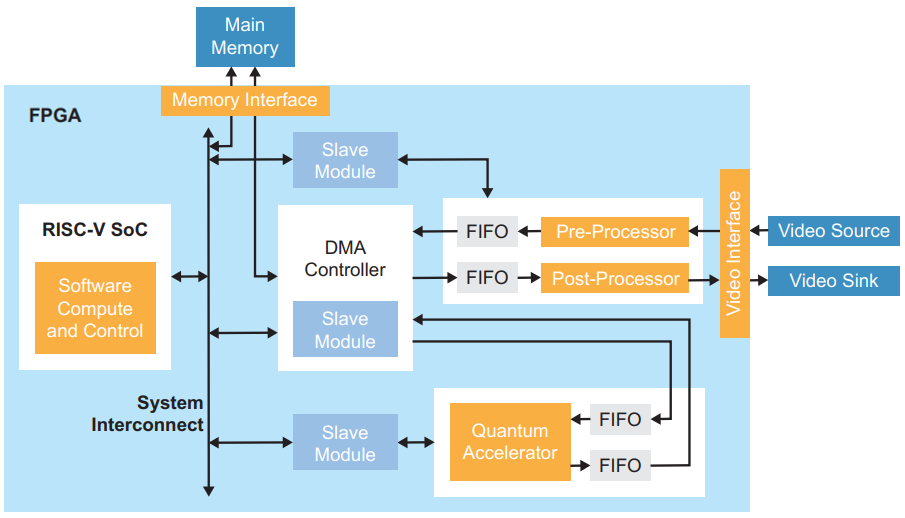

# Edge Vision SoC Framework

Welcome to the Edge Vision SoC GitHub repo. Efinix offers an RISC-V SoC framework targeted for edge vision applications, namely Edge Vision SoC (EVSoC) framework. This site provides source codes, example designs, and supporting materials of the EVSoC framework.
- [Overview](#overview)
- [Image Signal Processing Example Design](#image-signal-processing-example-design)
- [Dual-Camera Example Design](#dual-camera-example-design)
- [Hardware and Software Setup](#hardware-and-software-setup)
- [Documentation](#documentation)
- [Videos](#videos)
- [Quick Start](#quick-start)
- [Frequently Asked Questions](#frequently-asked-questions)

**Note:**
- The *main* branch contains new version of EVSoC, which is based on user configurable Efinix Sapphire RISC-V SoC.
- A branch named *evsoc_ruby* is created for the older version of EVSoC, which is based on Efinix Ruby Vision RISC-V SoC.

## Overview

Key features:
- **Modular building blocks** to facilitate different combinations of system design architecture
- **Established data transfer flow** between main memory and different building blocks through Direct Memory Access (DMA)
- **Ready-to-deploy** domain-specific **I/O peripherals and interfaces** (SW drivers, HW controllers, pre- and post-processing blocks are provided)
- Highly **flexible HW/SW co-design** is feasible (RISC-V performs control & compute, HW accelerator for time-critical computations)
- Enable **quick porting** of users' design for **edge AI and vision solutions**
<br />



Building blocks to facilitate ease of modification to suit for various system architecture requirements:
- **RISC-V SoC**
- **DMA Controller**
- **Camera**
- **Display**
- **Hardware Accelerator**

## Image Signal Processing Example Design

ISP example design demonstrates a use case on the EVSoC framework, specifically, **hardware/software co-design for video processing**. Additionally, the design shows how user can **control the FPGA hardware using software**, that is, user can enable different hardware acceleration functions by changing firmware in the RISC-V processor. 

This example presents these concepts in the context of video filtering functions; however, user can use the same design with **own hardware accelerator block** instead of the
provided filtering functions. The design helps user explore **accelerating computationally intensive functions** in **hardware** and using **RISC-V software** to **control that acceleration** as well as to **perform computations** that are **inherently sequential or require flexibility**.

List of implemented ISP algorithms (available for both SW functions and HW modules):
- RGB to grayscale conversion
- Sobel edge detection
- Binary dilation
- Binary erosion

## Dual-Camera Example Design

Multi-camera vision systems are vital for a wide-range of applications such as video surveillance, security system, robotics, automotive and drone. The benefits of multi-camera vision system over single-camera setup include:
- Resolve occlusion problem
- Provide wider area coverage
- Produce more accurate geometric understanding
<br />

EVSoC presents a dual-camera example design that provides a flexible hardware accelerator socket for processing frame data from multiple camera sources based on the targeted applications.

List of implemented HW accelerator mode - Merging:
- Merge two horizontally half cropped frame from two camera sources by left and right
- Merge a downscaled overlay from one camera source on top of the frame data from another camera source
<br />

List of implemented HW accelerator mode - Processing:
- Cam source 1 – Passthrough (RGB or Grayscale); Cam source 2 – Passthrough (RGB or Grayscale)
- Cam source 1 – Passthrough (RGB or Grayscale); Cam source 2 – Processed   (Sobel)
- Cam source 1 – Processed   (Sobel);            Cam source 2 – Passthrough (RGB or Grayscale)
- Cam source 1 – Processed   (Sobel);            Cam source 2 – Processed   (Sobel)

## Hardware and Software Setup

The example designs are implemented on:
- [Trion® T120 BGA324 Development Kit](https://www.efinixinc.com/products-devkits-triont120bga324.html)
- [Trion® T120 BGA576 Development Kit](https://www.efinixinc.com/products-devkits-triont120bga576.html)
- [Titanium® Ti60 F225 Development Kit](https://www.efinixinc.com/products-devkits-titaniumti60f225.html)
- [Titanium® Ti180 M484 Development Kit](https://www.efinixinc.com/products-devkits-titaniumti180m484.html)

Efinity® IDE is required for project compilation and bitstream generation, whereas Efinity® RISC-V Embedded Software IDE is used to manage RISC-V software projects and for debugging purposes.

Please refer to [EVSoC User Guide](https://www.efinixinc.com/support/docsdl.php?s=ef&pn=UG-EVSOC) to get started.

### Software Tools Version
- [Efinity® IDE](https://www.efinixinc.com/support/efinity.php) v2022.2.322.1.8
- [Efinity® RISC-V Embedded Software IDE](https://www.efinixinc.com/support/efinity.php) v2022.2.3

## Documentation
- [EVSoC User Guide](https://www.efinixinc.com/support/docsdl.php?s=ef&pn=UG-EVSOC)
- [Sapphire RISC-V SoC Datasheet](https://www.efinixinc.com/support/docsdl.php?s=ef&pn=DS-SAPPHIREUG)
- [Ruby Vision RISC-V SoC Datasheet](https://www.efinixinc.com/support/docsdl.php?s=ef&pn=DS-RUBYV)
- [Trion T120 BGA324 Development Kit User Guide](https://www.efinixinc.com/support/docsdl.php?s=ef&pn=T120F324-DK-UG)
- [Trion T120 BGA576 Development Kit User Guide](https://www.efinixinc.com/support/docsdl.php?s=ef&pn=T120F576-DK-UG)
- [Titanium Ti60 F225 Development Kit User Guide](https://www.efinixinc.com/support/docsdl.php?s=ef&pn=Ti60F225-DK-UG)
- [Titanium Ti180 M484 Development Kit User Guide](https://www.efinixinc.com/support/docsdl.php?s=ef&pn=Ti180M484-DK-UG)

## Videos
- [Edge Vision SoC Solution](https://vimeo.com/492359014)
- [ISP Example Design Tutorial - Demonstration](https://vimeo.com/500651950)
- [ISP Example Design Tutorial - Firmware](https://vimeo.com/500660740)
- [ISP Example Design Tutorial - RTL Design](https://vimeo.com/500664581)
- [ISP Example Design Tutorial - Flash Memory Read & Write](https://vimeo.com/516979931)
- [Dual-Camera Example Design Tutorial](https://vimeo.com/516963010)
- [Ti60 F225 Demonstration](https://vimeo.com/715811780)

## Quick Start
For a quick start on Edge Vision SoC framework, combined hex file (FPGA bitstream + RISC-V application binary) for demo design is provided in quick_start directory.

Quick start design demo modes:
- Camera Capture + Display
- Camera Capture + RGB2Grayscale (SW) + Sobel (HW) + Display
- Camera Capture + RGB2Grayscale & Sobel (HW) + Display
- Camera Capture + RGB2Grayscale & Sobel & Dilation (HW) + Display

List of development kits & switches for selecting demo mode:
- [Trion® T120 BGA324 Development Kit](https://www.efinixinc.com/products-devkits-triont120bga324.html) - User DIP Switches 0 & 1
- [Trion® T120 BGA576 Development Kit](https://www.efinixinc.com/products-devkits-triont120bga576.html) - User DIP Switches 0 & 1
- [Titanium® Ti60 F225 Development Kit](https://www.efinixinc.com/products-devkits-titaniumti60f225.html) - User DIP Switches SW2 (Shared for CBSEL setting, can only used as user input after configuration)
- [Titanium® Ti180 M484 Development Kit](https://www.efinixinc.com/products-devkits-titaniumti180m484.html) - User Push Button SW4

Bring up quick start demo design on Efinix development kit by following listed steps below:
1. Set up hardware
   - Refer to *Set Up the Hardware* section in [EVSoC User Guide](https://www.efinixinc.com/support/docsdl.php?s=ef&pn=UG-EVSOC) for targeted development kit.
2. Program hex file using Efinity Programmer
   - Refer to [Efinity Programmer User Guide](https://www.efinixinc.com/support/docsdl.php?s=ef&pn=UG-EFN-PGM) to program quick start demo hex file to targeted development kit using Efinity Programmer in SPI active mode (T120 BGA324, T120 BGA576, Ti60 F225) or SPI Active using JTAG bridge mode (Ti180 M484).
3. Press CRESET button & Demo design is up and running

As the quick start demo design is programmed through SPI active mode or SPI Active using JTAG bridge mode, the design is stored in flash memory. Since flash is non-volatile memory, the design is retained even after power off. Hence, before loading other design, which is with separate FPGA bitstream and RISC-V application binary (run with Eclipse OpenOCD Debugger), user should erase the flash memory (recommend to erase 16MB for T120 BGA324 and T120 BGA576; 8MB for Ti60 F225; 32MB for Ti180M484 development kits) using Efinity Programmer.

## Frequently Asked Questions
1.  **Where are the HW/RTL and SW/firmware source files located?**

    The top-level RTL file is named *edge_vision_soc.v*, located in individual project folder. The rest of the RTL files are placed in *source* directory, which are organized according to respective building block. On the other hand, the main firmware file is named *main.c*, located in *embedded_sw/SapphireSoc/software/standalone/evsoc_\*/src* directory, where other related drivers are provided in the same folder as well.

    Below depicts the directory structure of EVSoC framework:
    
    ```
    ├── quick_start
    ├── T120F324_1280_720
    │   ├── embedded_sw
    │   │   └── SapphireSoc
    │   │       └── software
    │   │           └── standalone
    │   │               └── evsoc_*
    │   ├── ip
    │   ├── sim
    │   └── source
    ├── T120F324_1280_720_dualCam
    │   ├── embedded_sw
    │   │   └── SapphireSoc
    │   │       └── software
    │   │           └── standalone
    │   │               └── evsoc_*
    │   ├── ip
    │   └── source
    ├── T120F324_640_480
    │   ├── embedded_sw
    │   │   └── SapphireSoc
    │   │       └── software
    │   │           └── standalone
    │   │               └── evsoc_*
    │   ├── ip
    │   ├── sim
    │   └── source
    ├── T120F576_1280_720
    │   ├── embedded_sw
    │   │   └── SapphireSoc
    │   │       └── software
    │   │           └── standalone
    │   │               └── evsoc_*
    │   ├── ip
    │   ├── sim
    │   └── source
    ├── T120F576_1280_720_dualCam
    │   ├── embedded_sw
    │   │   └── SapphireSoc
    │   │       └── software
    │   │           └── standalone
    │   │               └── evsoc_*
    │   ├── ip
    │   └── source
    ├── T120F576_640_480
    │   ├── embedded_sw
    │   │   └── SapphireSoc
    │   │       └── software
    │   │           └── standalone
    │   │               └── evsoc_*
    │   ├── ip
    │   ├── sim
    │   └── source
    ├── Ti60F225_dsi
    │   ├── embedded_sw
    │   │   └── SapphireSoc
    │   │       └── software
    │   │           └── standalone
    │   │               └── evsoc_*
    │   ├── ip
    │   ├── sim
    │   └── source
    └── Ti180M484_hdmi
        ├── embedded_sw
        │   └── SapphireSoc
        │       └── software
        │           └── standalone
        │               └── evsoc_*
        ├── ip
        ├── sim
        └── source
    ```
    
    ***Note:*** Source files for Efinix soft-IP(s) are to be generated using IP Manager in Efinity® IDE, where IP settings files are provided in *ip* directory in respective project folder. Please refer to [EVSoC User Guide](https://www.efinixinc.com/support/docsdl.php?s=ef&pn=UG-EVSOC) for more detail.
    
2.  **How much is the resource consumption for EVSoC framework?**

    Below are the resource utilization tables compiled for Efinix Trion® T120F324 device using Efinity® IDE v2022.2.
    
    **Resource utilization for ISP example design (1280x720 resolution):**
    | Building Block          | LE    | FF    | ADD  | LUT   | MEM (M5K) | MULT |
    |-------------------------|:-----:|:-----:|:----:|:-----:|:---------:|:----:|
    | Edge Vision SoC (Total) | 33686 | 16418 | 3577 | 22653 | 204       | 4    |
    | RISC-V SoC              |   -   | 7168  | 796  | 6090  | 54        | 4    |
    | DMA Controller          |   -   | 7549  | 1247 | 15193 | 92        | 0    |
    | Camera                  |   -   | 767   | 968  | 679   | 22        | 0    |
    | Display                 |   -   | 173   | 113  | 85    | 10        | 0    |
    | Hardware Accelerator    |   -   | 648   | 437  | 426   | 26        | 0    |
    
    **Resource utilization for dual-camera example design (1280x720 resolution):**
    | Building Block          | LE    | FF    | ADD  | LUT   | MEM (M5K) | MULT |
    |-------------------------|:-----:|:-----:|:----:|:-----:|:---------:|:----:|
    | Edge Vision SoC (Total) | 38789 | 19092 | 4909 | 25534 | 264       | 4    |
    | RISC-V SoC              |   -   | 7168  | 796  | 6132  | 54        | 4    |
    | DMA Controller          |   -   | 9219  | 1453 | 17192 | 112       | 0    |
    | Camera (x2)             |   -   | 1534  | 1936 | 1335  | 44        | 0    |
    | Display                 |   -   | 173   | 113  | 107   | 10        | 0    |
    | Hardware Accelerator    |   -   | 871   | 595  | 557   | 44        | 0    |
    
    Below are the resource utilization tables compiled for Efinix Titanium® Ti60F225 device using Efinity® IDE v2022.2.
    
    **Resource utilization for ISP example design:**
    | Building Block           | XLR   | FF    | ADD  | LUT   | MEM (M10K) | DSP |
    |--------------------------|:-----:|:-----:|:----:|:-----:|:----------:|:---:|
    | Edge Vision SoC (Total)  | 33862 | 17902 | 3980 | 21625 | 189        | 4   |
    | RISC-V SoC               |   -   | 6724  | 697  | 5482  | 49         | 4   |
    | DMA Controller           |   -   | 4762  | 824  | 6072  | 53         | 0   |
    | CSI-2 RX Controller Core |   -   | 844   | 194  | 2036  | 15         | 0   |
    | DSI TX Controller Core   |   -   | 1737  | 409  | 3482  | 19         | 0   |
    | HyperRAM Controller Core |   -   | 1153  | 305  | 2096  | 22         | 0   |
    | Camera                   |   -   | 809   | 919  | 646   | 11         | 0   |
    | Display                  |   -   | 338   | 174  | 374   | 8          | 0   |
    | Hardware Accelerator     |   -   | 646   | 427  | 405   | 8          | 0   |

    Below are the resource utilization tables compiled for Efinix Titanium® Ti180M484 device using Efinity® IDE v2022.2.
    
    **Resource utilization for ISP example design (1920x1080 resolution):**
    | Building Block           | XLR   | FF    | ADD  | LUT   | MEM (M10K) | DSP |
    |--------------------------|:-----:|:-----:|:----:|:-----:|:----------:|:---:|
    | Edge Vision SoC (Total)  | 46150 | 26697 | 3660 | 29088 | 257        | 4   |
    | RISC-V SoC               |   -   | 15434 | 815  | 10503 | 105        | 4   |
    | DMA Controller           |   -   | 8362  | 973  | 15031 | 64         | 0   |
    | CSI-2 RX Controller Core |   -   | 618   | 204  | 1595  | 17         | 0   |
    | Camera                   |   -   | 740   | 946  | 671   | 11         | 0   |
    | Display                  |   -   | 707   | 223  | 560   | 46         | 0   |
    | Hardware Accelerator     |   -   | 555   | 410  | 317   | 14         | 0   |
    
    ***Note:*** Resource values may vary from compile-to-compile due to PnR and updates in RTL. The presented tables are served as reference purposes.

3.  **How to check if the hardware and software setup for ISP example design is done correctly?**
    
    After setting up the hardware and software accordingly (refer to [EVSoC User Guide](https://www.efinixinc.com/support/docsdl.php?s=ef&pn=UG-EVSOC) for the detail), user is to program the hardware bitstream (using *Efinity Programmer*) and software binary (using *Efinity RISC-V Embedded Software IDE*) to the targeted development kit. 
    
    User is expected to see colour bar on display, which lasts for a few seconds. This indicates the display, RISC-V, and DMA are running correctly. If *evsoc_ispExample* or *evsoc_ispExample_demo* software apps is used, user is expected to see video streaming of camera captured output (default mode) on display after the colour bar. This shows the camera is setup correctly too.
    
    In the case of the above expected outputs are not observed, user is to check on the board, camera, display, software setup, etc., with reference to [EVSoC User Guide](https://www.efinixinc.com/support/docsdl.php?s=ef&pn=UG-EVSOC).

4.	**How to modify camera input resolution from MIPI interface?**

    For HW, modify *MIPI_FRAME_WIDTH* and *MIPI_FRAME_HEIGHT* parameter values in *edge_vision_soc.v* accordingly. For SW, note to ensure the same set of values are set in camera SW driver (*PiCamDriver.c*) under *PiCam_init()* function, for example:
    ```
    PiCam_Output_Size(1920, 1080); 
    ```
    Refer to *Raspberry Pi Camera Module v2 Datasheet* for more detail about camera setting.

5.	**Why is after enabling Sobel operation (either HW or SW mode) in the firmware, display shows only black with scatter white lines/dots?**

    There are several potential factors that contribute to this, please try out the following adjustments:

    (a) Place an object with high colour contrast such as calendar, brochure, name card, etc., in front of the camera and observe the detected edge outlines. 

    (b) Modify the Sobel threshold value by changing the line:

    ```
    write_u32(100, EXAMPLE_AXI4_SLV + EXAMPLE_AXI4_SLV_REG0_OFFSET);
    ```

    in firmware (*main.c*). The Sobel threshold value is to be adjusted based on the lighting condition where the camera operates at.

6.	**Why is zooming effect observed on ISP example design, especially for 640x480 resolution?**

    This is due to the default setup performs cropping on the incoming 1920x1080 resolution MIPI camera frames to a smaller size eg., 640x480 resolution, prior to further processing. To perform resizing with scaling method, modify the *CROP_SCALE* parameter that is passed to *cam_picam_v2* instance at *edge_vision_soc.v*.
    
7.	**Why are captured frames not of central view of the camera?**

    This is due to the default setup for cropping is with X- and Y-offsets *(0,0)*. To adjust the cropping offsets, modify the *X_START* and *Y_START* parameter values that are passed to *crop* instance at *cam_picam_v2.v*. 

8.	**What is the mechanism used to configure and trigger an DMA transfer?**

    RISC-V firmware is used to configure DMA controller through APB3 slave port. SW driver for DMA controller (*dmasg.h*) is in *embedded_sw/SapphireSoc/software/standalone/driver* directory.

9.	**How does RISC-V detect completion of a triggered DMA transfer?**

    User can make use of polling or interrupt mode in RISC-V firmware to detect the completion of an DMA transfer. In the ISP example design, DMA completion checking with polling mode is demonstrated in the firmware (*main.c*).

    The following presents an example for converting the default self-restart display DMA channel to make use of interrupt mode to indicate DMA transfer completion of single video frame. In *main.c*, make these changes to the *Trigger Display* section:

    ```
    //SELECT start address of to be displayed data accordingly.
    dmasg_input_memory(DMASG_BASE, DMASG_DISPLAY_MM2S_CHANNEL, CAM_START_ADDR, 16);
    //dmasg_input_memory(DMASG_BASE, DMASG_DISPLAY_MM2S_CHANNEL, GRAYSCALE_START_ADDR, 16);
    //dmasg_input_memory(DMASG_BASE, DMASG_DISPLAY_MM2S_CHANNEL, SOBEL_START_ADDR, 16);
    dmasg_output_stream(DMASG_BASE, DMASG_DISPLAY_MM2S_CHANNEL, DMASG_DISPLAY_MM2S_PORT, 0, 0, 1);

    //Add interrupt config command
    dmasg_interrupt_config(DMASG_BASE, DMASG_DISPLAY_MM2S_CHANNEL, DMASG_CHANNEL_INTERRUPT_CHANNEL_COMPLETION_MASK);
    dmasg_direct_start(DMASG_BASE, DMASG_DISPLAY_MM2S_CHANNEL, (IMG_WIDTH*IMG_HEIGHT)*4, 0);
    
    //Indicate that the display DMA channel is active
    display_mm2s_active = 1;
    ```
    
    In *dmasg_config.h*, go to the *externalInterrupt()* function and set up the interrupt service subroutine accordingly.

    ```
    void trigger_next_display_dma () {
       dmasg_input_memory(DMASG_BASE, DMASG_DISPLAY_MM2S_CHANNEL, CAM_START_ADDR, 16);
       dmasg_output_stream(DMASG_BASE, DMASG_DISPLAY_MM2S_CHANNEL, DMASG_DISPLAY_MM2S_PORT, 0, 0, 1);
       dmasg_interrupt_config(DMASG_BASE, DMASG_DISPLAY_MM2S_CHANNEL, DMASG_CHANNEL_INTERRUPT_CHANNEL_COMPLETION_MASK);
       dmasg_direct_start(DMASG_BASE, DMASG_DISPLAY_MM2S_CHANNEL, (IMG_WIDTH*IMG_HEIGHT)*4, 0);
    }

    void externalInterrupt(){
      uint32_t claim;
      //While there is pending interrupts
      while(claim = plic_claim(BSP_PLIC, BSP_PLIC_CPU_0)){
         switch(claim){
            case PLIC_DMASG_CHANNEL:
               if(display_mm2s_active && !(dmasg_busy(DMASG_BASE, DMASG_DISPLAY_MM2S_CHANNEL))) {
                  trigger_next_display_dma();
               }
               break;
            default: crash(); break;
         }
         plic_release(BSP_PLIC, BSP_PLIC_CPU_0, claim); //unmask the claimed interrupt
      }
    }
    ```

10. **How to customize RISC-V firmware for different HW/SW scenarios available in the ISP example design?**

    Please refer to *Customizing the Firmware* section in [EVSoC User Guide](https://www.efinixinc.com/support/docsdl.php?s=ef&pn=UG-EVSOC) for the detail.

11. **How to replace the example ISP hardware accelerator core with user custom accelerator?**

    Please refer to *Using Your Own Hardware Accelerator* section in [EVSoC User Guide](https://www.efinixinc.com/support/docsdl.php?s=ef&pn=UG-EVSOC) for the detail.

12. **How to obtain processing frame rate of a specific scenario in the ISP example design?**
    
    Software app *evsoc_ispExample_timestamp* is provided in *embedded_sw/SapphireSoc/software/standalone* directory for this purpose. MIPI camera input frame rate is determined by a hardware counter in camera building block, whereas software timestamp method is used for the processing frame rate profiling purposes. Formulae used to compute frames/second and seconds/frame are provided in the *main.c*. 
