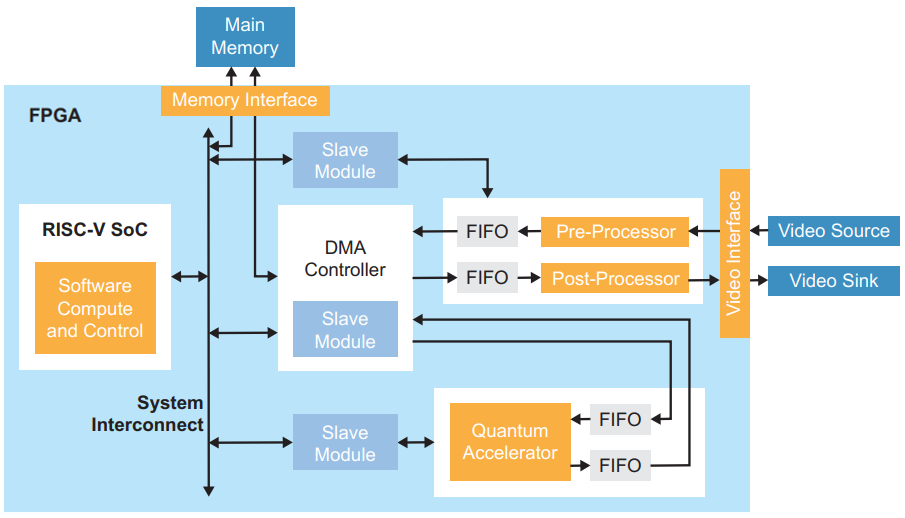

# Edge Vision SoC (EVSoC) Framework


Welcome to the **Edge Vision SoC (EVSoC)** framework repository.

EVSoC is an FPGA-based RISC-V SoC reference platform from Efinix, designed for rapid development of edge vision and AI applications. It provides modular hardware building blocks, ready-to-use software drivers, and complete example designs to accelerate HW/SW co-design workflows.

---

## 📌 Repository Structure

- [Overview](#overview)
- [Example Designs](#example-designs)
    - [Image Signal Processing (ISP) Example](#image-signal-processing-isp-example)
    - [Dual-Camera Example](#dual-camera-example)
- [Hardware and Software Setup](#hardware-and-software-setup)
- [Documentation](#documentation)
- [Videos](#videos)
- [Quick Start](#quick-start)
- [Frequently Asked Questions](#frequently-asked-questions)


---

## 🔀 Branch Information

- **`main` branch**  
  Latest EVSoC version based on the configurable **Efinix Sapphire RISC-V SoC**.

- **`evsoc_ruby` branch**  
  Legacy EVSoC version based on the **Efinix Ruby Vision RISC-V SoC**.

<br />

---

<br />

# Overview

## Key Features

- **Modular building blocks** to facilitate different combinations of system design architecture
- **Established data transfer flow** between main memory and different building blocks through Direct Memory Access (DMA)
- **Ready-to-deploy** domain-specific **I/O peripherals and interfaces** (SW drivers, HW controllers, pre- and post-processing blocks are provided)
- Highly **flexible HW/SW co-design** is feasible (RISC-V performs control & compute, HW accelerator for time-critical computations)
- Enable **quick porting** of users' design for **edge AI and vision solutions**

<br />



## Core Building Blocks

- RISC-V SoC
- DMA Controller
- Camera Subsystem
- Display Subsystem
- Hardware Accelerator Interface


# Example Designs

## Image Signal Processing (ISP) Example

ISP example design demonstrates a use case on the EVSoC framework, specifically, **hardware/software co-design for video processing**. Additionally, the design demonstrates how users can **control the FPGA hardware through software**, that is, user can enable different hardware acceleration functions by changing firmware in the RISC-V processor. 

This example presents these concepts in the context of video filtering functions; however, users can replace the provided accelerator with their **own custom hardware accelerator block** instead of the
provided filtering functions. The design helps user explore **accelerating computationally intensive functions** in **hardware** and using **RISC-V software** to **control that acceleration** as well as to **perform computations** that are **inherently sequential or require flexibility**.

List of implemented ISP algorithms (available for both SW functions and HW modules):
- RGB to grayscale conversion
- Sobel edge detection
- Binary dilation
- Binary erosion

## Dual-Camera Example

Multi-camera vision systems are widely used in applications such as surveillance, robotics, automotive, and drones. The benefits of multi-camera vision system over single-camera setup include:
- Resolve occlusion problem
- Provide wider area coverage
- Produce more accurate geometric understanding
<br />

EVSoC presents a dual-camera example design that provides a flexible hardware accelerator socket for processing frame data from multiple camera sources based on the targeted applications.

List of implemented HW accelerator mode - Merging:
- Merge two horizontally half cropped frame from two camera sources by left and right
- Merge a downscaled overlay from one camera source on top of the frame data from another camera source
<br />

List of implemented HW accelerator mode - Processing:
- Cam source 1 – Passthrough (RGB or Grayscale); Cam source 2 – Passthrough (RGB or Grayscale)
- Cam source 1 – Passthrough (RGB or Grayscale); Cam source 2 – Processed   (Sobel)
- Cam source 1 – Processed   (Sobel);            Cam source 2 – Passthrough (RGB or Grayscale)
- Cam source 1 – Processed   (Sobel);            Cam source 2 – Processed   (Sobel)

<br />

# Hardware & Software Requirements

## Supported Development Kits

- [Trion® T120 BGA324 Development Kit](https://www.efinixinc.com/products-devkits-triont120bga324.html)
- [Trion® T120 BGA576 Development Kit](https://www.efinixinc.com/products-devkits-triont120bga576.html)
- [Titanium® Ti60 F225 Development Kit](https://www.efinixinc.com/products-devkits-titaniumti60f225.html)
- [Titanium® Ti180 J484 Development Kit](https://www.efinixinc.com/products-devkits-titaniumti180j484.html)

## Required Tools & Version

[**Efinity® IDE**](https://www.efinixinc.com/support/efinity.php) – FPGA synthesis & implementation - v2026.1.132
[**Efinity® RISC-V Embedded Software IDE**](https://www.efinixinc.com/support/efinity.php) – Firmware development & debugging - v2026.1.0.7

Please refer to [EVSoC User Guide](https://www.efinixinc.com/support/docsdl.php?s=ef&pn=UG-EVSOC) to get started.


## Supported Cameras

1. Raspberry PI Camera Module v2
   - Sony IMX219 image sensor 
2. Raspberry PI Camera Module v3
   - Sony IMX708 image sensor 

> 💡 **Camera Detection (v2025.2 and later)**
>
> Starting from **v2025.2**, the system automatically detects whether PiCAM v2 or v3 is connected.
>
> For older versions, enable PiCAM v3 manually in `main.c`:
>
> ```c
> #define PICAM_VERSION 3
> ```
>
> If assertion errors occur:
> - Verify camera connection
> - Check ribbon cable orientation
> - Confirm stable power supply


<br />

# Documentation
- [EVSoC User Guide](https://www.efinixinc.com/support/docsdl.php?s=ef&pn=UG-EVSOC)
- [Sapphire RISC-V SoC User Guide](https://www.efinixinc.com/support/docsdl.php?s=ef&pn=SAPPHIREUG)
- [Sapphire RISC-V SoC Datasheet](https://www.efinixinc.com/support/docsdl.php?s=ef&pn=SAPPHIREDS)
- [Ruby Vision RISC-V SoC Datasheet](https://www.efinixinc.com/support/docsdl.php?s=ef&pn=DS-RUBYV)
- [Trion T120 BGA324 Development Kit User Guide](https://www.efinixinc.com/support/docsdl.php?s=ef&pn=T120F324-DK-UG)
- [Trion T120 BGA576 Development Kit User Guide](https://www.efinixinc.com/support/docsdl.php?s=ef&pn=T120F576-DK-UG)
- [Titanium Ti60 F225 Development Kit User Guide](https://www.efinixinc.com/support/docsdl.php?s=ef&pn=Ti60F225-DK-UG)
- [Titanium Ti180 J484 Development Kit User Guide](https://www.efinixinc.com/support/docsdl.php?s=ef&pn=Ti180J484-DK-UG)

<br />

# Videos
- [Edge Vision SoC Solution](https://vimeo.com/492359014)
- [ISP Example Design Tutorial - Demonstration](https://vimeo.com/500651950)
- [ISP Example Design Tutorial - Firmware](https://vimeo.com/500660740)
- [ISP Example Design Tutorial - RTL Design](https://vimeo.com/500664581)
- [ISP Example Design Tutorial - Flash Memory Read & Write](https://vimeo.com/516979931)
- [Dual-Camera Example Design Tutorial](https://vimeo.com/516963010)
- [Ti60 F225 Demonstration](https://vimeo.com/715811780)

<br />

# Quick Start
For a quick start on Edge Vision SoC framework, combined hex file (FPGA bitstream + RISC-V application binary) for demo design is provided in the release package.

Quick start demo modes for single camera designs & keyboard input to choose:
- ("a") Camera Capture + HDMI Display                                        
- ("b") Camera Capture + RGB2Grayscale (SW) + HDMI Display                   
- ("c") Camera Capture + RGB2Grayscale (SW) + Sobel (HW) + HDMI Display      
- ("d") Camera Capture + RGB2Grayscale (HW) + HDMI Display                   
- ("e") Camera Capture + RGB2Grayscale & Sobel (HW) + HDMI Display           
- ("f") Camera Capture + RGB2Grayscale & Sobel & Dilation (HW) + HDMI Display
- ("g") Camera Capture + RGB2Grayscale & Sobel & Erosion  (HW) + HDMI Display


Quick start demo modes for dual camera designs:
- ("a") Merge Left + Right   - RGB Colour (cam 1) + RGB Colour (cam 2)
- ("b") Merge Main + Overlay - RGB Colour (cam 1) + RGB Colour (cam 2)
- ("c") Merge Main + Overlay - RGB Colour (cam 2) + RGB Colour (cam 1)
- ("d") Merge Main + Overlay - Grayscale  (cam 1) + Sobel      (cam 2)
- ("e") Merge Main + Overlay - Sobel      (cam 1) + Sobel      (cam 2)


Bring up quick start demo design on Efinix development kit by following listed steps below:
1. Set up hardware
   - Refer to *Set Up the Hardware* section in [EVSoC User Guide](https://www.efinixinc.com/support/docsdl.php?s=ef&pn=UG-EVSOC) for targeted development kit.
2. Program hex file using Efinity Programmer
   - Refer to [Efinity Programmer User Guide](https://www.efinixinc.com/support/docsdl.php?s=ef&pn=UG-EFN-PGM) to program quick start demo hex file to targeted development kit using Efinity Programmer in SPI active mode (T120 BGA324, T120 BGA576, Ti60 F225) or SPI Active using JTAG bridge mode (Ti180 J484).
3. Press CRESET button and the demo design shall be up and running. 

Since the demo is stored in non-volatile flash memory, it must be erased before loading a different design. See the section below for recommended erase sizes.

## Flash Erase Requirement Before Loading a New Design

The **Quick Start** demo design is programmed using either **SPI Active** mode or **SPI Active via JTAG Bridge** mode. In both cases, the design is stored in **non-volatile flash memory**, meaning it remains intact even after powering off the board.

Before loading a new design — which includes a separate **FPGA bitstream** and **RISC-V application binary** (built and run using the **Efinity RISC-V Embedded Software IDE**) — it is important to **erase the flash memory** to avoid conflicts with the existing image.

> #### Recommended Flash Erase Size (using Efinity Programmer)
> - **T120 BGA324 / T120 BGA576**: Erase at least **16 MB**
> - **Ti60 F225**: Erase at least **8 MB**
> - **Ti180 J484**: Erase at least **32 MB**

<br />

# Frequently Asked Questions
1.  **Where are the HW/RTL and SW/firmware source files located?**

    The top-level RTL file is named *edge_vision_soc.v*, located in individual project folder. The rest of the RTL files are placed in *source* directory, which are organized according to respective building block. On the other hand, the main firmware file is named *main.c*, located in *embedded_sw/SapphireSoc/software/standalone/evsoc_\*/src* directory, where other related drivers are provided in the same folder as well.

    Below depicts the directory structure of EVSoC framework:
    
    ```
    ├── cam_single/
    │   ├── T120F324_640_480/
    │   │   ├── embedded_sw/      # Software projects
    │   │   │   └── SapphireSoc
    │   │   │       └── software
    │   │   │           └── standalone
    │   │   │               └── evsoc_*
    │   │   ├── ip
    |   |   ├── sim
    │   │   └── source
    │   ├── T120F324_1280_720/
    │   |   └── ...
    │   ├── T120F576_640_480/
    │   |   └── ...
    │   ├── T120F576_1280_720/
    │   |   └── ...
    │   ├── Ti60F225_dsi/
    │   |   └── ...
    │   └── Ti180J484_hdmi/
    │       └── ...
    └──cam_dual/
       ├── T120F324_1280_720_dualCam/
       │   ├── embedded_sw/      # Software projects
       │   │   └── SapphireSoc
       │   │       └── software
       │   │           └── standalone
       │   │               └── evsoc_*
       │   ├── ip
       |   ├── sim
       │   └── source
       └── T120F576_1280_720_dualCam/
           └── ...
    ```
    
    > 💡 **Note:**  
    > All soft IPs are pre-generated and included in the design except Sapphire SoC. You do **not** need to regenerate them unless you intend to upgrade to a newer IP version. For Sapphire SoC, please regenerate the IP with the latest Efinity version. 
    > 
    > These IPs are integrated as *static IPs*, meaning their top-level modules are already included in the design except for the Sapphire SoC, which remains dynamic.  
    > 
    > If you wish to upgrade or downgrade a specific IP based on your Efinity version:
    > - First, **remove the IP’s top-level module** from your design file list in Efinity.
    > - Then, **re-import the IP** using its corresponding `.json` file.
    > 
    > ⚠️ However, Efinix **strongly recommends** using the included IP versions, as they are the latest validated and tested releases.
    
2.  **How much is the resource consumption for EVSoC framework?**

    Below are the resource utilization tables compiled for Efinix Trion® T120F324 device using Efinity® IDE v2026.1.132.
    
    **Resource utilization for ISP example design (1280x720 resolution):**
    | Building Block          | LE    | FF    | ADD  | LUT   | MEM (M5K) | MULT |
    |-------------------------|:-----:|:-----:|:----:|:-----:|:---------:|:----:|
    | Edge Vision SoC (Total) | 36414 | 17946 | 3690 | 24551 | 433       | 4    |
    | RISC-V SoC              |   -   | 7615  | 802  | 6473  | 54        | 4    |
    | DMA Controller          |   -   | 8557  | 1418 | 16608 | 321       | 0    |
    | Camera                  |   -   | 801   | 941  | 684   | 22        | 0    |
    | Display                 |   -   | 222   | 112  | 108   | 10        | 0    |
    | Hardware Accelerator    |   -   | 639   | 405  | 419   | 26        | 0    |
    
    **Resource utilization for dual-camera example design (1280x720 resolution):**
    | Building Block          | LE    | FF    | ADD  | LUT   | MEM (M5K) | MULT |
    |-------------------------|:-----:|:-----:|:----:|:-----:|:---------:|:----:|
    | Edge Vision SoC (Total) | 40161 | 20046 | 4793 | 26459 | 487       | 4    |
    | RISC-V SoC              |   -   | 7615  | 802  | 6216  | 54        | 4    |
    | DMA Controller          |   -   | 9564  | 1437 | 17663 | 338       | 0    |
    | Camera (x2)             |   -   | 1602  | 1882 | 1367  | 44        | 0    |
    | Display                 |   -   | 222   | 112  | 107   | 10        | 0    |
    | Hardware Accelerator    |   -   | 917   | 548  | 549   | 41        | 0    |
    
    Below are the resource utilization tables compiled for Efinix Titanium® Ti60F225 device using Efinity® IDE v2026.1.132.
    
    **Resource utilization for ISP example design:**
    | Building Block           | XLR   | FF    | ADD  | LUT   | MEM (M10K) | DSP |
    |--------------------------|:-----:|:-----:|:----:|:-----:|:----------:|:---:|
    | Edge Vision SoC (Total)  | 34216 | 18739 | 4074 | 21233 | 253        | 4   |
    | RISC-V SoC               |   -   | 7154  | 703  | 5785  | 48         | 4   |
    | DMA Controller           |   -   | 5107  | 990  | 6422  | 107        | 0   |
    | CSI-2 RX Controller Core |   -   | 941   | 187  | 2093  | 15         | 0   |
    | DSI TX Controller Core   |   -   | 1954  | 488  | 3426  | 25         | 0   |
    | HyperRAM Controller Core |   -   | 929   | 174  | 1076  | 27         | 0   |
    | Camera                   |   -   | 779   | 903  | 656   | 11         | 0   |
    | Display                  |   -   | 338   | 173  | 285   | 8          | 0   |
    | Hardware Accelerator     |   -   | 621   | 395  | 385   | 8          | 0   |

    Below are the resource utilization tables compiled for Efinix Titanium® Ti180J484 device using Efinity® IDE v2026.1.132.
    
    **Resource utilization for ISP example design (1920x1080 resolution):**
    | Building Block           | XLR   | FF    | ADD  | LUT   | MEM (M10K) | DSP |
    |--------------------------|:-----:|:-----:|:----:|:-----:|:----------:|:---:|
    | Edge Vision SoC (Total)  | 42878 | 24025 | 3650 | 26865 | 358        | 4   |
    | RISC-V SoC               |   -   | 12371 | 768  | 7947  | 92         | 4   |
    | DMA Controller           |   -   | 8759  | 1201 | 15671 | 178        | 0   |
    | CSI-2 RX Controller Core |   -   | 766   | 152  | 1475  | 17         | 0   |
    | Camera                   |   -   | 741   | 924  | 681   | 11         | 0   |
    | Display                  |   -   | 618   | 221  | 325   | 45         | 0   |
    | Hardware Accelerator     |   -   | 554   | 346  | 315   | 14         | 0   |
    
    ***Note:*** Resource values may vary from compile-to-compile due to PnR and updates in RTL. The presented tables are provided for reference purposes only.

3.  **How to check if the hardware and software setup for ISP example design is done correctly?**
    
    After setting up the hardware and software accordingly (refer to [EVSoC User Guide](https://www.efinixinc.com/support/docsdl.php?s=ef&pn=UG-EVSOC) for the detail), user is to program the hardware bitstream (using *Efinity Programmer*) and software binary (using *Efinity RISC-V Embedded Software IDE*) to the targeted development kit. 
    
    User is expected to see colour bar on display, which lasts for a few seconds. This indicates the display, RISC-V, and DMA are running correctly. If *evsoc_ispExample* or *evsoc_ispExample_demo* software apps is used, user is expected to see video streaming of camera captured output (default mode) on display after the colour bar. This shows the camera is setup correctly too.
    
    In the case of the above expected outputs are not observed, user is to check on the board, camera, display, software setup, etc., with reference to [EVSoC User Guide](https://www.efinixinc.com/support/docsdl.php?s=ef&pn=UG-EVSOC).

4.	**How to modify camera input resolution from MIPI interface?**

    For HW, modify *MIPI_FRAME_WIDTH* and *MIPI_FRAME_HEIGHT* parameter values in *edge_vision_soc.v* accordingly. For SW, note to ensure the same set of values are set in camera SW driver (*PiCamDriver.c*) under *PiCam_init()* function, for example:
    ```
    PiCam_Output_Size(1920, 1080); 
    ```
    Refer to *Raspberry Pi Camera Module v2 Datasheet* for more detail about camera setting.

5.	**Why is after enabling Sobel operation (either HW or SW mode) in the firmware, display shows only black with scatter white lines/dots?**

    There are several potential factors that contribute to this, please try out the following adjustments:

    (a) Place an object with high colour contrast such as calendar, brochure, name card, etc., in front of the camera and observe the detected edge outlines. 

    (b) Modify the Sobel threshold value by changing the line:

    ```
    write_u32(100, EXAMPLE_AXI4_SLV + EXAMPLE_AXI4_SLV_REG0_OFFSET);
    ```

    in firmware (*main.c*). The Sobel threshold value is to be adjusted based on the lighting condition where the camera operates at.

6.	**Why is zooming effect observed on ISP example design, especially for 640x480 resolution?**

    This is due to the default setup performs cropping on the incoming 1920x1080 resolution MIPI camera frames to a smaller size eg., 640x480 resolution, prior to further processing. To perform resizing with scaling method, modify the *CROP_SCALE* parameter that is passed to *cam_picam_v2* instance at *edge_vision_soc.v*.
    
7.	**Why are captured frames not of central view of the camera?**

    This is due to the default setup for cropping is with X- and Y-offsets *(0,0)*. To adjust the cropping offsets, modify the *X_START* and *Y_START* parameter values that are passed to *crop* instance at *cam_picam_v2.v*. 

8.	**What is the mechanism used to configure and trigger an DMA transfer?**

    RISC-V firmware is used to configure DMA controller through APB3 slave port. SW driver for DMA controller (*dmasg.h*) is in *embedded_sw/SapphireSoc/software/standalone/driver* directory.

9.	**How does RISC-V detect completion of a triggered DMA transfer?**

    User can make use of polling or interrupt mode in RISC-V firmware to detect the completion of an DMA transfer. In the ISP example design, DMA completion checking with polling mode is demonstrated in the firmware (*main.c*).

    The following presents an example for converting the default self-restart display DMA channel to make use of interrupt mode to indicate DMA transfer completion of single video frame. In *main.c*, make these changes to the *Trigger Display* section:

    ```
    //SELECT start address of to be displayed data accordingly.
    dmasg_input_memory(DMASG_BASE, DMASG_DISPLAY_MM2S_CHANNEL, CAM_START_ADDR, 16);
    //dmasg_input_memory(DMASG_BASE, DMASG_DISPLAY_MM2S_CHANNEL, GRAYSCALE_START_ADDR, 16);
    //dmasg_input_memory(DMASG_BASE, DMASG_DISPLAY_MM2S_CHANNEL, SOBEL_START_ADDR, 16);
    dmasg_output_stream(DMASG_BASE, DMASG_DISPLAY_MM2S_CHANNEL, DMASG_DISPLAY_MM2S_PORT, 0, 0, 1);

    //Add interrupt config command
    dmasg_interrupt_config(DMASG_BASE, DMASG_DISPLAY_MM2S_CHANNEL, DMASG_CHANNEL_INTERRUPT_CHANNEL_COMPLETION_MASK);
    dmasg_direct_start(DMASG_BASE, DMASG_DISPLAY_MM2S_CHANNEL, (IMG_WIDTH*IMG_HEIGHT)*4, 0);
    
    //Indicate that the display DMA channel is active
    display_mm2s_active = 1;
    ```
    
    In *main.c*, go to the *externalInterrupt()* function and set up the interrupt service subroutine accordingly.

    ```
    void trigger_next_display_dma () {
       dmasg_input_memory(DMASG_BASE, DMASG_DISPLAY_MM2S_CHANNEL, CAM_START_ADDR, 16);
       dmasg_output_stream(DMASG_BASE, DMASG_DISPLAY_MM2S_CHANNEL, DMASG_DISPLAY_MM2S_PORT, 0, 0, 1);
       dmasg_interrupt_config(DMASG_BASE, DMASG_DISPLAY_MM2S_CHANNEL, DMASG_CHANNEL_INTERRUPT_CHANNEL_COMPLETION_MASK);
       dmasg_direct_start(DMASG_BASE, DMASG_DISPLAY_MM2S_CHANNEL, (IMG_WIDTH*IMG_HEIGHT)*4, 0);
    }

    void externalInterrupt(){
      uint32_t claim;
      //While there is pending interrupts
      while(claim = plic_claim(BSP_PLIC, BSP_PLIC_CPU_0)){
         switch(claim){
            case PLIC_DMASG_CHANNEL:
               if(display_mm2s_active && !(dmasg_busy(DMASG_BASE, DMASG_DISPLAY_MM2S_CHANNEL))) {
                  trigger_next_display_dma();
               }
               break;
            default: crash(); break;
         }
         plic_release(BSP_PLIC, BSP_PLIC_CPU_0, claim); //unmask the claimed interrupt
      }
    }
    ```

10. **How to customize RISC-V firmware for different HW/SW scenarios available in the ISP example design?**

    Please refer to *Customizing the Firmware* section in [EVSoC User Guide](https://www.efinixinc.com/support/docsdl.php?s=ef&pn=UG-EVSOC) for the detail.

11. **How to replace the example ISP hardware accelerator core with user custom accelerator?**

    Please refer to *Using Your Own Hardware Accelerator* section in [EVSoC User Guide](https://www.efinixinc.com/support/docsdl.php?s=ef&pn=UG-EVSOC) for the detail.

12. **How to obtain processing frame rate of a specific scenario in the ISP example design?**
    
    Software app *evsoc_ispExample_timestamp* is provided in *embedded_sw/SapphireSoc/software/standalone* directory for this purpose. MIPI camera input frame rate is determined by a hardware counter in camera building block, whereas software timestamp method is used for the processing frame rate profiling purposes. Formulae used to compute frames/second and seconds/frame are provided in the *main.c*. 

13. **How to create combined bitstream for the FPGA and firmware?**

    The default soft RISC-V SoC bootloader loads firmware from 0x0038_0000. When creating a combined image, ensure that:
    - The FPGA bitstream is located at 0x0000_0000
    - The RISC-V firmware is located at 0x0038_0000

<br />

----
